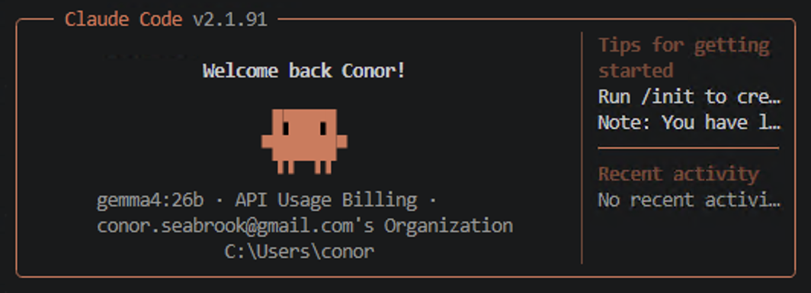
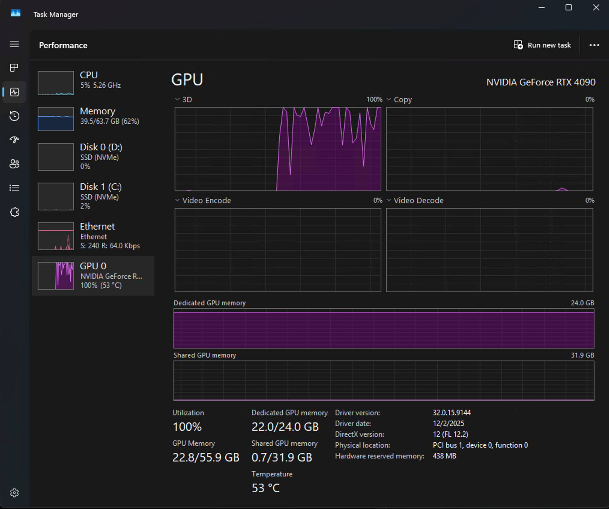
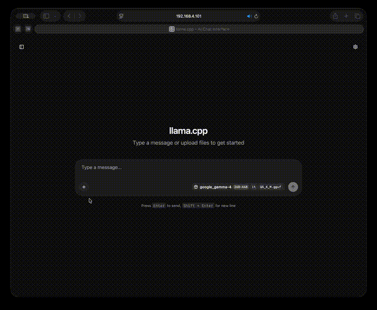
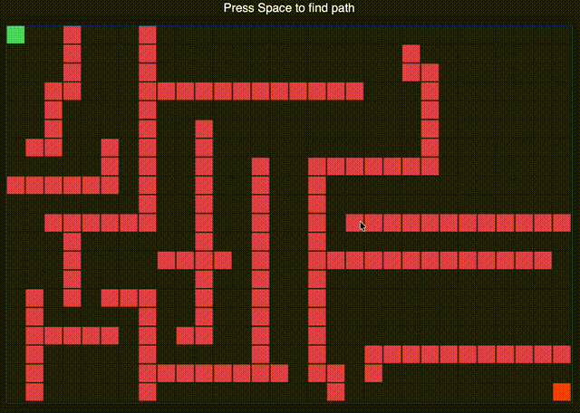

# Gemma 4 26B + TurboQuant on a Single RTX 4090



Google's [Gemma 4 26B-A4B](https://blog.google/innovation-and-ai/technology/developers-tools/gemma-4/) (April 2026) running at full 262K context with multimodal vision on a single consumer GPU, using [TurboQuant](https://arxiv.org/abs/2504.19874) 3-bit KV cache compression (ICLR 2026). 22.3 GB of 24 GB VRAM, 129 tok/s, fully local. This repository documents the configuration, build process, and a 15-test agentic coding benchmark run through [Claude Code](https://docs.anthropic.com/en/docs/claude-code).

---

## Configuration

### Inference Stack

| Parameter | Value |
|-----------|-------|
| Model | Gemma 4 26B-A4B-it ([model card](https://ai.google.dev/gemma/docs)) |
| Architecture | MoE — 128 experts, 8 active per forward pass |
| Total / active parameters | 25.8B / ~4B |
| Weight quantization | Q5_K_M (5-bit, GGUF) |
| KV cache quantization | turbo3 (3-bit, [TurboQuant](https://arxiv.org/abs/2504.19874)) |
| Context window | 262,144 tokens |
| Inference engine | [TheTom/llama-cpp-turboquant](https://github.com/TheTom/llama-cpp-turboquant) (branch `feature/turboquant-kv-cache`) |
| Flash Attention | Required for turbo KV types (`-fa on`) |
| Vision | Enabled via `--mmproj` multimodal projector (+1.2 GB VRAM) |

### Hardware

| Component | Spec |
|-----------|------|
| GPU | NVIDIA RTX 4090 — 24,564 MiB VRAM, SM89 Ada Lovelace |
| CPU | Intel Core i9, 32 threads |
| OS | Windows 11 Pro |
| CUDA | 13.2 |

### VRAM Budget

| Component | Size |
|-----------|------|
| Model weights (Q5_K_M) | ~18 GB |
| KV cache (turbo3, 262K) | ~3 GB |
| Multimodal projector | ~1.2 GB |
| Overhead | ~1.3 GB |
| **Total (with vision)** | **23.5 / 24.6 GB** |

KV cache is smaller than dense-model estimates because MoE attention layers are shared across experts. Cache size scales with attention dimensions, not total parameter count. Without TurboQuant (FP16 KV), 262K context would require ~16 GB for KV alone — exceeding the 4090's capacity.



### Throughput

| Metric | Value |
|--------|-------|
| Generation (single request) | ~129 tok/s |
| Generation (concurrent) | ~83–85 tok/s |
| Prefill | ~5,600 tok/s |

### Architecture

```
┌──────────────────────────────────────┐     ┌──────────────────────────────────┐
│         MAC (Client)                 │     │       WINDOWS PC (Server)        │
│                                      │     │                                  │
│  Claude Code CLI                     │     │  llama-server.exe                │
│    │                                 │     │    ├─ Gemma 4 26B-A4B (Q5_K_M)  │
│    │  Anthropic Messages API         │     │    ├─ TurboQuant turbo3 KV cache │
│    └─────────────────────────────────┼────▶│    ├─ CUDA Flash Attention       │
│      http://<server-ip>:8081         │     │    └─ 262K context window        │
└──────────────────────────────────────┘     └──────────────────────────────────┘
```

Claude Code connects to llama-server via the OpenAI-compatible chat completions endpoint. No modifications to Claude Code are required.

### Quantization Tradeoffs

**Weight quantization (Q4 vs Q5):** Q5_K_M allocates 5 bits per weight vs Q4_K_M's 4 bits. Both use k-quant mixed precision, assigning higher bit depth to attention and output layers. Q5 uses ~2 GB more VRAM and is ~8% slower but preserves more weight precision. TurboQuant's KV cache savings were reinvested into Q5 over Q4.

**KV cache quantization (turbo3 vs turbo4):**

| Mode | Bits | Compression | Notes |
|------|------|-------------|-------|
| turbo3 | 3 | 4.9x | Tensor-core MMA codepath — faster prefill |
| turbo4 | 4 | 3.8x | QJL correction uses slower codepath |

turbo3 was selected. Despite lower bit depth, it achieves faster prefill via the MMA codepath. Quality difference is minimal for MoE models where attention is a smaller fraction of total computation.

### Optimization Progression

| Config | VRAM | Throughput | Context |
|--------|------|------------|---------|
| Q4_K_M, Ollama (baseline) | 22.0 GB | 113 tok/s | 32K |
| Q4_K_M, turbo3, FA | 19.1 GB | 139 tok/s | 131K |
| Q5_K_M, turbo3, FA | 21.5 GB | 129 tok/s | 131K |
| **Q5_K_M, turbo3, FA** | **22.3 GB** | **129 tok/s** | **262K** |

## Benchmark

### Methodology

15 agentic coding tasks across 6 difficulty levels, executed through Claude Code connected to the Gemma 4 backend. Each test was run in a fresh session with context cleared between tests.

The model operated under a [constrained system prompt](claude-config/CLAUDE.md) that enforces single tool calls per step, mandatory file reads before edits, and a two-failure escalation limit. These constraints are required — unconstrained testing produced stalled tool chains and repeated identical failures. Results reflect the model operating within these guardrails.

Test definitions, prompts, and fixture files: [tests/](tests/)

### Test Levels

| Level | Category | Description |
|-------|----------|-------------|
| 1 | Single file generation | Create one file from a specification |
| 2 | Read + modify | Read existing code, add features or refactor |
| 3 | Multi-step verification | Write code, execute, verify output correctness |
| 4 | Debugging | Locate and fix planted bugs (1–3 per file) |
| 5 | Multi-file coordination | Create 4–5 files with cross-module dependencies |
| 6 | Test-driven implementation | Implement code to pass a pre-written 20-case pytest suite |

### Results

| Test | Level | Pass | Quality (1–5) | Errors | Self-Recovery | Notes |
|------|-------|------|---------------|--------|---------------|-------|
| 1A Text stats | 1 | PASS | 4 | 0 | — | |
| 1B Graph class | 1 | PASS | 3 | 0 | — | Dead code from abandoned approach |
| 1C CSV transformer | 1 | PASS | 4 | 0 | — | |
| 2A Add feature | 2 | PASS | 4 | 0 | — | |
| 2B Add algorithm | 2 | PASS | 4 | 0 | — | |
| 2C Refactor | 2 | PASS | 4 | 0 | — | |
| 3A Write + run | 3 | PASS | 3 | 5 | Yes | Invalid tool parameters after task completion |
| 3B Generate + process | 3 | PASS | 4 | 1 | Yes | |
| 3C HTTP endpoint | 3 | PASS | 4 | 0 | — | |
| 4A Runtime bug | 4 | PASS | 5 | 0 | — | Identified on first attempt |
| 4B Logic bugs (x2) | 4 | PASS | 5 | 0 | — | Both identified on first attempt |
| 4C Multi-error (x3) | 4 | PASS | 5 | 0 | — | All three identified on first attempt |
| 5A Multi-file package | 5 | PASS | 5 | 0 | — | 4 files, correct relative imports |
| 5B Config-driven app | 5 | PASS | 3 | 1 | Yes | Inconsistent config path fix across modules |
| 6A Test-driven impl | 6 | PASS | 5 | 0 | — | 20/20 pytest cases on first implementation |

**15/15 passed.** Average quality: 4.2/5. Total errors: 7. Self-recovery: 3/3.

### Observations

**Debugging.** All 6 planted bugs across 3 tests were identified on the first attempt without iterative debugging.

**Tool-use termination.** Test 3A produced 5 consecutive invalid tool calls after the task was complete. The model recovered, but this indicates unreliable state tracking at tool-use chain boundaries.

**Cross-file consistency.** Test 5B required self-recovery from a config path error. The fix was applied to `main.py` but not `server.py`, indicating incomplete dependency tracking across modules.

**Upper bound.** An informal test (13-file HTML5 application) produced correct file structure but non-functional code. This was run near context exhaustion and is not conclusive.

## Demos

### Vision — Financial Document Analysis

Analyzing Apple's FY25 Q4 consolidated financial statements from an uploaded image. Multimodal inference enabled via `--mmproj` projector file (+1.2 GB VRAM).

<details>
<summary>Show demo</summary>



</details>

### A* Pathfinder

Interactive visualization generated in a single pass via Claude Code. Source: [demos/pathfinder/index.html](demos/pathfinder/index.html)

<details>
<summary>Show demo</summary>



</details>

## Reproducing This

### Requirements

- NVIDIA GPU with 24+ GB VRAM (RTX 4090, RTX 3090, A5000, or equivalent)
- [Claude Code](https://docs.anthropic.com/en/docs/claude-code)
- Python 3.10+, pytest

### Build

Compile the TurboQuant fork of llama.cpp with CUDA and Flash Attention: [docs/build-guide.md](docs/build-guide.md)

Adjust `-DCMAKE_CUDA_ARCHITECTURES` for target GPU (89 = Ada Lovelace, 86 = Ampere, 75 = Turing).

### Connect Claude Code

Environment variable configuration: [docs/claude-code-setup.md](docs/claude-code-setup.md)

### Run

```bash
git clone https://github.com/conorseabrook/gemma4-turboquant-bench.git
cd gemma4-turboquant-bench
cp claude-config/CLAUDE.md .
```

Tests are in [tests/](tests/). Each level directory contains a `prompt.md` with exact prompts. Run sequentially — Level 2 modifies Level 1 outputs. Clear context (`/clear`) between tests. Level 4 requires copying fixture files before prompting.

### Notes

- The TurboQuant fork may evolve or merge upstream. Pin to a known commit for exact reproduction.
- Results are specific to Q5_K_M. Other quantization levels may produce different quality scores.
- The constrained system prompt is required. Results without it are not comparable.
- TurboQuant is not yet in mainline llama.cpp ([discussion](https://github.com/ggml-org/llama.cpp/discussions/20969)) or Ollama as of April 2026.

## References

- Zandieh et al., "QJL: 1-Bit Quantized JL Transform for KV Cache Quantization with Zero Overhead", ICLR 2026. [arXiv:2504.19874](https://arxiv.org/abs/2504.19874)
- Google Research, ["TurboQuant: Redefining AI efficiency with extreme compression"](https://research.google/blog/turboquant-redefining-ai-efficiency-with-extreme-compression/), March 2026.
- Google DeepMind, ["Gemma 4: Our most capable open models to date"](https://blog.google/innovation-and-ai/technology/developers-tools/gemma-4/), April 2026.
- [llama.cpp](https://github.com/ggml-org/llama.cpp)
- [TheTom/llama-cpp-turboquant](https://github.com/TheTom/llama-cpp-turboquant)
- [Claude Code documentation](https://docs.anthropic.com/en/docs/claude-code)

## License

MIT
