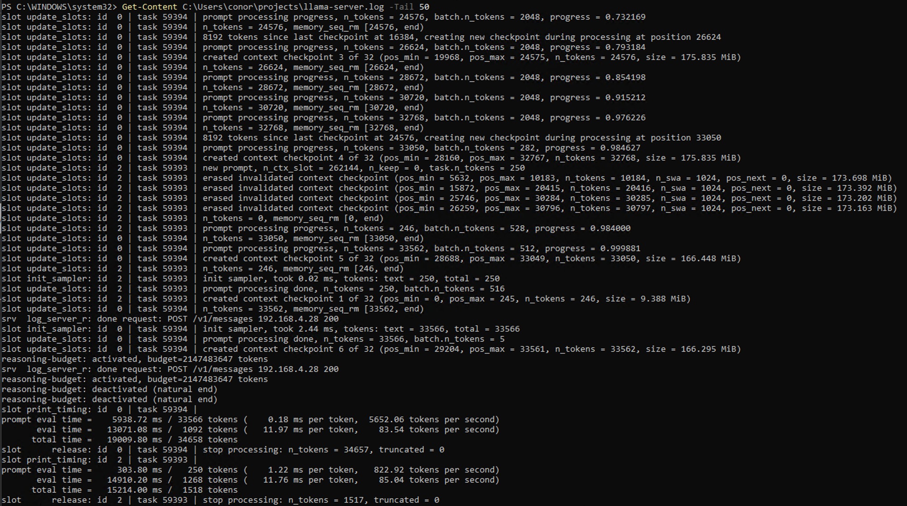

# Gemma 4 26B + TurboQuant: 262K Context on a Single RTX 4090

Full-context inference of Gemma 4 26B-A4B on consumer hardware using TurboQuant KV cache compression, with an agentic coding benchmark run through Claude Code.

## Abstract

Gemma 4 26B-A4B is a Mixture of Experts model (128 experts, 8 active, ~4B active parameters per forward pass) with a native context window of 262,144 tokens. At FP16 KV precision, serving this context on a 24 GB GPU is not feasible — KV cache alone would exceed VRAM capacity.

TurboQuant (Zandieh et al., [arXiv:2504.19874](https://arxiv.org/abs/2504.19874)) compresses the KV cache from FP16 to 3-bit using PolarQuant rotation and QJL residual correction, achieving ~5.3x compression. Combined with Q5_K_M weight quantization and CUDA Flash Attention, the full 262K context window fits within 22.3 GB on a single RTX 4090.

To evaluate whether this configuration produces usable output for agentic coding tasks, a 15-test benchmark suite was run across 6 difficulty levels using Claude Code as the tool-use harness. The model passed all 15 tests. Detailed results and methodology are provided below.

## Configuration

### Hardware

| Component | Spec |
|-----------|------|
| GPU | NVIDIA RTX 4090 (24,564 MiB VRAM, SM89 Ada Lovelace) |
| CPU | Intel Core i9 (32 threads) |
| OS | Windows 11 Pro |
| CUDA | 13.2 |

### Inference Stack

| Parameter | Value |
|-----------|-------|
| Model | Gemma 4 26B-A4B-it |
| Architecture | MoE, 128 experts, 8 active per forward pass |
| Total parameters | 25.8B |
| Active parameters | ~4B |
| Weight quantization | Q5_K_M (5-bit, GGUF format) |
| KV cache quantization | turbo3 (3-bit) |
| Context window | 262,144 tokens |
| Inference engine | llama.cpp ([TheTom/llama-cpp-turboquant](https://github.com/TheTom/llama-cpp-turboquant), branch `feature/turboquant-kv-cache`) |
| Flash Attention | Enabled (`-fa on`, required for turbo KV types) |

### VRAM Utilization

| Component | Size |
|-----------|------|
| Model weights (Q5_K_M) | ~18 GB |
| KV cache (turbo3, 262K) | ~3 GB |
| Overhead | ~1.3 GB |
| **Total** | **22.3 / 24.6 GB** |

The KV cache is smaller than dense-model estimates would suggest. In MoE architectures, attention layers are shared across all experts — KV cache scales with attention dimensions, not total parameter count.


### Measured Performance

| Metric | Value |
|--------|-------|
| Generation throughput (single request) | ~129 tok/s |
| Generation throughput (concurrent) | ~83-85 tok/s |
| Prefill rate (33K token context) | 5,652 tok/s |



### Network Topology

```
┌──────────────────────────────────────┐     ┌──────────────────────────────────┐
│         MAC (Client)                 │     │       WINDOWS PC (Server)        │
│                                      │     │                                  │
│  Claude Code CLI                     │     │  llama-server.exe                │
│    │                                 │     │    ├─ Gemma 4 26B-A4B (Q5_K_M)  │
│    │  Anthropic Messages API         │     │    ├─ TurboQuant turbo3 KV cache │
│    └─────────────────────────────────┼────▶│    ├─ CUDA Flash Attention       │
│      http://<server-ip>:8081         │     │    └─ 262K context window        │
└──────────────────────────────────────┘     └──────────────────────────────────┘
```

Claude Code connects to llama-server via the OpenAI-compatible chat completions endpoint. No modifications to Claude Code are required.

### Optimization Progression

| Config | VRAM | Throughput | Context |
|--------|------|------------|---------|
| Q4_K_M, Ollama (baseline) | 22.0 GB | 113 tok/s | 32K |
| Q4_K_M, turbo3, FA | 19.1 GB | 139 tok/s | 131K |
| Q5_K_M, turbo3, FA | 21.5 GB | 129 tok/s | 131K |
| **Q5_K_M, turbo3, FA** | **22.3 GB** | **129 tok/s** | **262K** |

Migrating from Ollama to llama.cpp with TurboQuant and Flash Attention increased context 8x (32K to 262K) and throughput 14% (113 to 129 tok/s) while enabling higher-quality weight quantization (Q4 to Q5).

### turbo3 vs turbo4

| Mode | Bits | Compression | Notes |
|------|------|-------------|-------|
| turbo3 | 3 | 4.9x | Uses tensor-core MMA codepath — faster prefill |
| turbo4 | 4 | 3.8x | QJL correction falls back to slower codepath |

turbo3 was selected over turbo4. Despite lower bit depth, turbo3 achieves faster prefill due to the MMA codepath. Quality degradation from 4-bit to 3-bit KV is minimal for MoE models where attention layers represent a smaller fraction of total computation.

## Benchmark

### Methodology

15 agentic coding tasks across 6 difficulty levels, executed through Claude Code connected to the Gemma 4 backend. Each test was run in a fresh session with context cleared between tests.

The model operated under a [constrained system prompt](claude-config/CLAUDE.md) designed for local model limitations: single tool calls per step, mandatory file reads before edits, and a two-failure escalation limit. Results reflect model capability *with* these constraints. Unconstrained testing in earlier iterations produced significantly degraded performance (stalled tool chains, repeated identical failures).

Test definitions, prompts, and fixture files are in [tests/](tests/).

### Test Levels

| Level | Category | Description |
|-------|----------|-------------|
| 1 | Single file generation | Create one file from a specification |
| 2 | Read + modify | Read existing code, add features or refactor |
| 3 | Multi-step verification | Write code, execute, verify output correctness |
| 4 | Debugging | Locate and fix planted bugs (1-3 per file) |
| 5 | Multi-file coordination | Create 4-5 files with cross-module dependencies |
| 6 | Test-driven implementation | Implement code to pass a pre-written 20-case pytest suite |

### Results

| Test | Level | Pass | Quality (1-5) | Errors | Self-Recovery | Notes |
|------|-------|------|---------------|--------|---------------|-------|
| 1A Text stats | 1 | PASS | 4 | 0 | — | |
| 1B Graph class | 1 | PASS | 3 | 0 | — | Dead code from abandoned approach |
| 1C CSV transformer | 1 | PASS | 4 | 0 | — | |
| 2A Add feature | 2 | PASS | 4 | 0 | — | |
| 2B Add algorithm | 2 | PASS | 4 | 0 | — | |
| 2C Refactor | 2 | PASS | 4 | 0 | — | Used plan mode unprompted |
| 3A Write + run | 3 | PASS | 3 | 5 | Yes | Invalid tool parameters after task completion |
| 3B Generate + process | 3 | PASS | 4 | 1 | Yes | |
| 3C HTTP endpoint | 3 | PASS | 4 | 0 | — | Server start/test/stop lifecycle |
| 4A Runtime bug | 4 | PASS | 5 | 0 | — | Identified on first attempt |
| 4B Logic bugs (x2) | 4 | PASS | 5 | 0 | — | Both bugs identified on first attempt |
| 4C Multi-error (x3) | 4 | PASS | 5 | 0 | — | All three bugs identified on first attempt |
| 5A Multi-file package | 5 | PASS | 5 | 0 | — | 4 files, correct relative imports |
| 5B Config-driven app | 5 | PASS | 3 | 1 | Yes | Config path error, inconsistent fix across modules |
| 6A Test-driven impl | 6 | PASS | 5 | 0 | — | 20/20 pytest cases on first implementation |

**15/15 passed.** Average quality: 4.2/5. Total errors across all tests: 7. Self-recovery rate: 3/3.

### Observations

**Debugging performance exceeded expectations.** All planted bugs were identified on the first attempt across all three Level 4 tests (6 total bugs). This is consistent with bug detection relying on local pattern matching over code structure, a task well-suited to MoE expert routing.

**Tool-use loop termination is fragile.** Test 3A produced 5 consecutive invalid tool calls after the task was already complete. The model recovered without intervention, but the failure mode suggests unreliable state tracking at tool-use chain boundaries.

**Cross-file consistency degrades under complexity.** Test 5B (5 interconnected files) required self-recovery from a config path error. The fix was applied to `main.py` but not to `server.py`'s standalone entry point, indicating the model does not maintain a complete dependency graph across files.

**The agentic ceiling was not reached within this suite.** An informal test outside the suite (13-file HTML5 application) produced architecturally correct but non-functional output, though this was conducted near context exhaustion and is not conclusive.

## Reproducing This

### Requirements

- NVIDIA GPU with 24+ GB VRAM (RTX 4090, RTX 3090, A5000, or equivalent)
- [Claude Code](https://docs.anthropic.com/en/docs/claude-code)
- Python 3.10+, pytest

### Build

Compile the TurboQuant fork of llama.cpp with CUDA and Flash Attention: [docs/build-guide.md](docs/build-guide.md)

Adjust `-DCMAKE_CUDA_ARCHITECTURES` for your GPU architecture (89 = Ada Lovelace, 86 = Ampere, 75 = Turing).

### Connect Claude Code

Configure environment variables to point Claude Code at the local server: [docs/claude-code-setup.md](docs/claude-code-setup.md)

### Run

```bash
git clone https://github.com/conorseabrook/gemma4-turboquant-bench.git
cd gemma4-turboquant-bench
cp claude-config/CLAUDE.md .
```

Tests are in [tests/](tests/). Each level directory contains a `prompt.md` with exact prompts. Run sequentially — Level 2 modifies files created by Level 1. Clear context (`/clear`) between tests. Level 4 requires copying fixture files before prompting.

### Reproducibility Notes

- The TurboQuant fork (`TheTom/llama-cpp-turboquant`, branch `feature/turboquant-kv-cache`) may evolve or merge upstream. Pin to a known commit for exact reproduction.
- Results are specific to Q5_K_M quantization. Other quantization levels may produce different quality scores.
- The constrained system prompt is required. Results without it are not comparable.
- Ollama does not support TurboQuant as of April 2026.

## References

- Zandieh et al., "QJL: 1-Bit Quantized JL Transform for KV Cache Quantization with Zero Overhead", ICLR 2026. [arXiv:2504.19874](https://arxiv.org/abs/2504.19874)
- [Gemma 4 Model Card](https://ai.google.dev/gemma/docs)
- [llama.cpp](https://github.com/ggml-org/llama.cpp)
- [Claude Code](https://docs.anthropic.com/en/docs/claude-code)

## License

MIT
